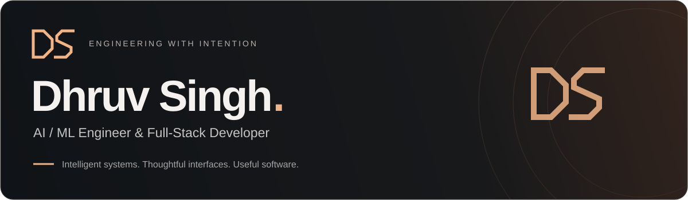

  

  <a href="https://portfolio-iota-brown-94.vercel.app"><strong>Explore my portfolio ↗</strong></a>
  &nbsp;&nbsp;·&nbsp;&nbsp;
  <a href="https://www.linkedin.com/in/dhruv-singh-06857831a/">LinkedIn</a>
  &nbsp;&nbsp;·&nbsp;&nbsp;
  <a href="https://leetcode.com/u/dhruvsingh895/">LeetCode</a>
  &nbsp;&nbsp;·&nbsp;&nbsp;
  <a href="mailto:dhruvsingh050908@gmail.com">Email</a>

 

### A little about me

I'm an AI/ML graduate based in **Kanpur, India**, building across computer vision and full-stack development. I enjoy turning complicated workflows into software that feels clear and useful—from understanding traffic to organizing the places people work.

**800+** LeetCode problems solved &nbsp; / &nbsp; **150+** GeeksforGeeks problems &nbsp; / &nbsp; **8.07** B.Tech CGPA

 

### Selected work

<table>
  <tr>
    <td width="50%" valign="top">
      <h3><a href="https://github.com/dhruvsingh895/Ethara-SAPSM">Seat Allocation System ↗</a></h3>
      
Connecting people, workspaces, and projects through role-based workflows and AI-assisted queries.

      
<code>Next.js</code> <code>FastAPI</code> <code>PostgreSQL</code>

    </td>
    <td width="50%" valign="top">
      <h3><a href="https://github.com/dhruvsingh895/Vehicle_detection">Traffic Vision ↗</a></h3>
      
Vehicle detection and counting with computer vision, plus a dashboard for exploring traffic analytics.

      
<code>Python</code> <code>OpenCV</code> <code>YOLOv8</code>

    </td>
  </tr>
  <tr>
    <td width="50%" valign="top">
      <h3><a href="https://github.com/dhruvsingh895/taskflow">Taskflow ↗</a></h3>
      
A shared workspace for managing tasks and keeping progress visible, backed by authenticated APIs.

      
<code>React</code> <code>Node.js</code> <code>MongoDB</code>

    </td>
    <td width="50%" valign="top">
      <h3><a href="https://github.com/dhruvsingh895/Portfolio">Interactive Portfolio ↗</a></h3>
      
A cinematic 3D portfolio with two themes, interactive project worlds, and a branching Story Mode.

      
<code>React</code> <code>Three.js</code> <code>Vite</code>

    </td>
  </tr>
</table>

Also building **[PGConnect](https://github.com/dhruvsingh895/pgconnect)** — PG and hostel management with owner and tenant dashboards and rent payments.

 

### Tools I work with

| Focus | Toolkit |
| :--- | :--- |
| Interfaces | TypeScript · JavaScript · React · Next.js · Tailwind CSS |
| APIs & data | Python · FastAPI · Node.js · Express · PostgreSQL · MongoDB |
| Applied intelligence | OpenCV · YOLOv8 · Machine learning · Deep learning |
| Development | Git · Docker · REST APIs |

 

### Beyond the code

I enjoy solving problems, learning how systems work, and a good game of **[chess](https://www.chess.com/member/anonymous_895x)**.

---

**Have something in mind? [Let's build it together ↗](mailto:dhruvsingh050908@gmail.com)**
