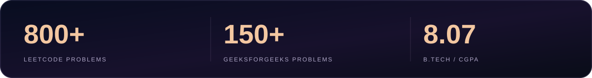
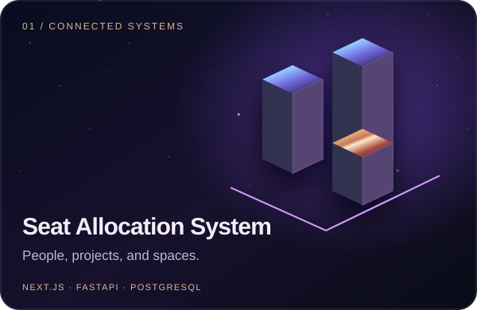
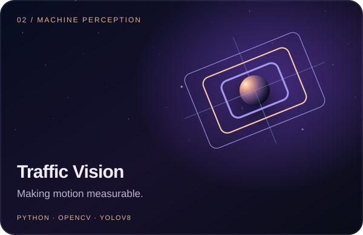
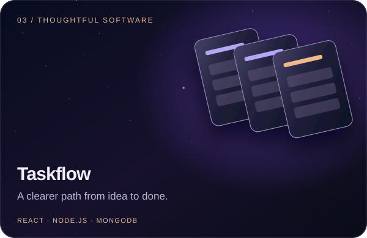
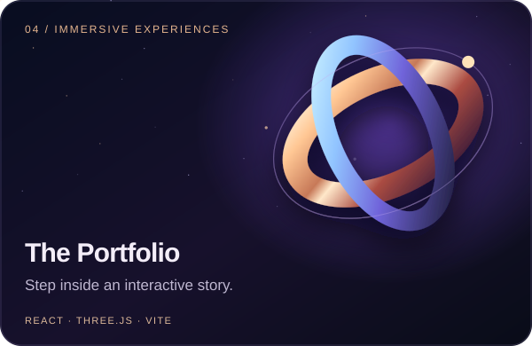
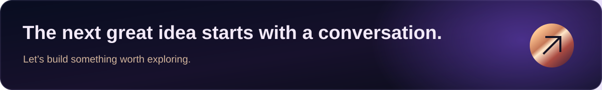

  

  <a href="https://portfolio-iota-brown-94.vercel.app"><strong>ENTER MY PORTFOLIO ↗</strong></a>
  &nbsp;&nbsp; / &nbsp;&nbsp;
  <a href="https://www.linkedin.com/in/dhruv-singh-06857831a/">LINKEDIN</a>
  &nbsp;&nbsp; / &nbsp;&nbsp;
  <a href="https://leetcode.com/u/dhruvsingh895/">LEETCODE</a>
  &nbsp;&nbsp; / &nbsp;&nbsp;
  <a href="mailto:dhruvsingh050908@gmail.com">LET'S TALK</a>

 

### 01 / The mind behind the work

I'm **Dhruv**, an AI/ML graduate based in **Kanpur, India**. I build intelligent systems and full-stack products—connecting computer vision, reliable APIs, and interfaces that make complex things feel simple.

I like ambitious ideas, thoughtful details, and software that earns its place in someone's day.

 

### 02 / Explore the build log

Four projects. Four different problems. One drive to make things work beautifully.

<table>
<tr>
<td width="50%"></td>
<td width="50%"></td>
</tr>
<tr>
<td width="50%"></td>
<td width="50%"></td>
</tr>
</table>

**Also building → [PGConnect](https://github.com/dhruvsingh895/pgconnect)** · PG and hostel management, owner and tenant dashboards, and rent payments.

 

### 03 / My engineering toolkit

| Layer | Technologies |
| :--- | :--- |
| **Interfaces** | TypeScript · JavaScript · React · Next.js · Tailwind CSS |
| **Systems** | Python · FastAPI · Node.js · Express · REST APIs |
| **Intelligence** | OpenCV · YOLOv8 · Machine learning · Deep learning |
| **Foundation** | PostgreSQL · MongoDB · Docker · Git |

 

### 04 / Outside the editor

Always learning. Often solving a problem. Sometimes thinking three moves ahead on the **[chessboard ↗](https://www.chess.com/member/anonymous_895x)**.

 

Built with curiosity. Refined with care.

