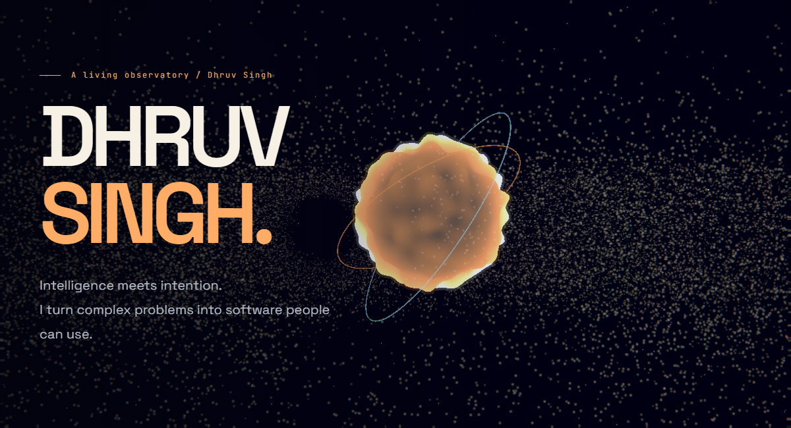

**[ENTER THE LIVING OBSERVATORY ↗](https://portfolio-iota-brown-94.vercel.app/universe.html)** &nbsp; / &nbsp; [Portfolio](https://portfolio-iota-brown-94.vercel.app) &nbsp; / &nbsp; [LinkedIn](https://www.linkedin.com/in/dhruv-singh-06857831a/) &nbsp; / &nbsp; [Email](mailto:dhruvsingh050908@gmail.com)

 

## 01 — A spark with somewhere to go.

I'm **Dhruv Singh**, an AI/ML graduate and full-stack developer in **Kanpur, India**. I build systems that make difficult problems clearer: recognizing vehicles, connecting people to workspaces, and turning a task list into progress.

**800+ LeetCode problems** · **150+ GeeksforGeeks problems** · **8.07 B.Tech CGPA**

 

## 02 — Small acts. A city of light.

My contribution calendar becomes a 3D skyline in the observatory. Every tower corresponds to a dated record, with a table available alongside the scene.

**101 contributions** across the calendar window · **2-day longest streak** · **July 2026: 86 contributions**

[Explore the contribution city ↗](https://portfolio-iota-brown-94.vercel.app/universe.html#light)

Snapshot: 06 October 2026. Calendar window: 06 October 2025–06 October 2026. GitHub visibility rules apply.

 

## 03 — Different tools. Shared ambition.

**Interfaces** &nbsp; TypeScript / JavaScript / React / Next.js / Tailwind CSS 
**Systems** &nbsp; Python / FastAPI / Node.js / Express / REST APIs 
**Intelligence** &nbsp; OpenCV / YOLOv8 / Machine learning / Deep learning 
**Foundation** &nbsp; PostgreSQL / MongoDB / Docker / Git

The current public-code snapshot spans **7 languages** across non-fork repositories. In the [language galaxy](https://portfolio-iota-brown-94.vercel.app/universe.html#languages), each cluster filters the projects that use it.

 

## 04 — Three worlds. Built to matter.

### [Seat Allocation System ↗](https://github.com/dhruvsingh895/Ethara-SAPSM)
People, workspaces, and projects in one role-based platform—with analytics and AI-assisted queries. 
`Next.js` `FastAPI` `PostgreSQL`

### [Traffic Vision ↗](https://github.com/dhruvsingh895/Vehicle_detection)
Vehicle detection and counting with computer vision, plus a dashboard for exploring traffic analytics. 
`Python` `OpenCV` `YOLOv8`

### [Taskflow ↗](https://github.com/dhruvsingh895/taskflow)
A shared workspace for tasks and progress, backed by authenticated APIs. 
`React` `Node.js` `MongoDB`

[Visit the repository planets ↗](https://portfolio-iota-brown-94.vercel.app/universe.html#worlds) · Also building [PGConnect](https://github.com/dhruvsingh895/pgconnect)

 

## 05 — Read between the commits.

The observatory turns **27 sampled public events** into an activity tunnel. Saturday and 00:00 UTC were the busiest weekday and hour **within that sample**. Those observations aren't claims about my complete working history.

[Inspect the signals and their limits ↗](https://portfolio-iota-brown-94.vercel.app/universe.html#signals)

 

## 06 — What shall we build next?

Bring a difficult problem, a bold idea, or a little curiosity.

**[Start a conversation ↗](mailto:dhruvsingh050908@gmail.com)** &nbsp; / &nbsp; [Challenge me at chess](https://www.chess.com/member/anonymous_895x)

---

The interactive observatory includes a guided tour, keyboard command palette, quality settings, two themes, and a reduced-motion view. Its downloadable HTML runs offline; the artwork above is captured from the actual experience.
